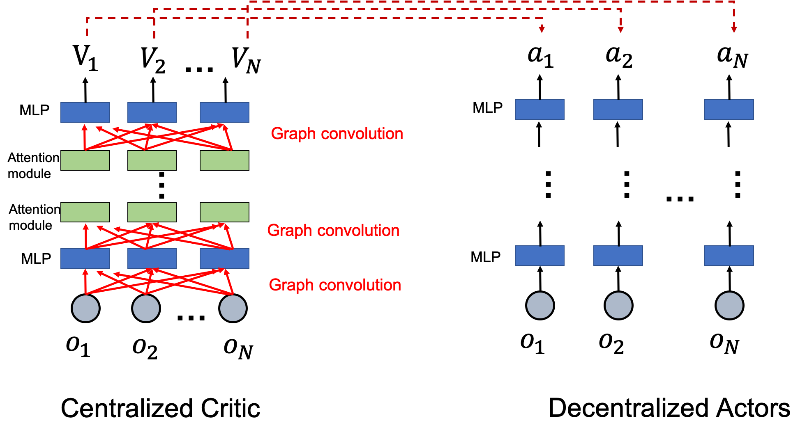
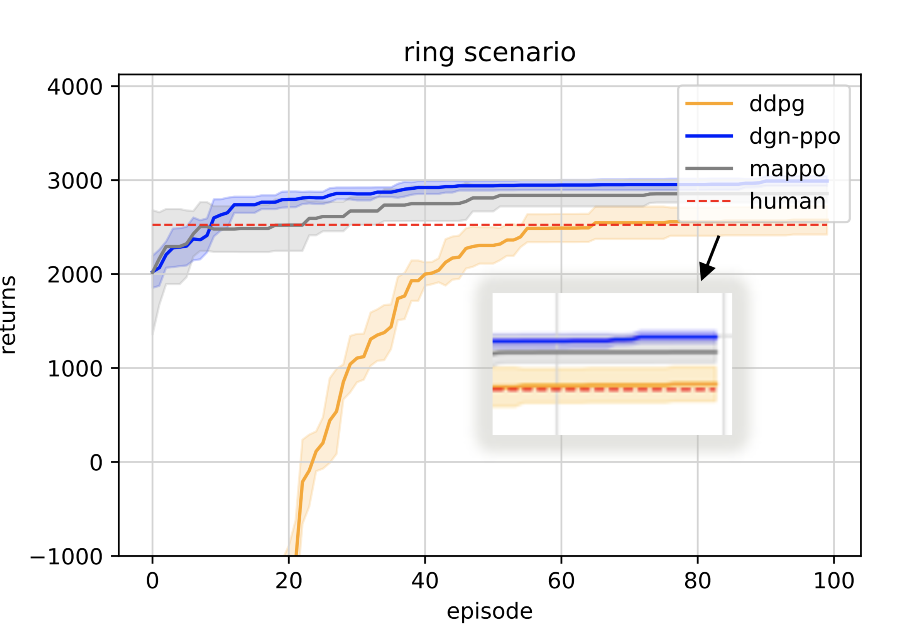

This is the source code of COMP 767 group project of Tianyu Shi & Jiawei Wang.

## Code structure:

Our main implementation of this model is in dgn_xxx (xxx represents for different scenario, e.g. ring network, figure eight network, or minicity network)

In each folder, you can find e.g. xxx_main-DGN.py this is the file to run; 

In DGN.py, we define the main network structure and training process; 

In xxx_Env.py we define the simulation environment. 

Also, we implemented transportation method (Intelligent driver model), RL methods (DDPG, multi-agent version of PPO) in three different scenarios.

In explore folder, we saved some models that we tested, include different model structures, number of agents, etc.

## How to reproduce:

Our model structure is :

Some parameters of models in the experiment settings:

| Models config    | units of encoder layer    | activation function | clip ratio   | discount factor | Optimizer | softupdate parameter | learning rate(actor+critic)|max returns|
| :----------------: | :---------: | :-------------: | :-----: | :---------: | :-------------: | :------------: | :-----:|:---:|
|   DGN  a | (128 , 128) | ReLU         | 0.3 | 0.9      | adam         | 0.01    |（1e-4 , 1e-4)|`2982.97`|
| DGN  b  | `(512 , 128)` | ReLU        | 0.3 | 0.9    | adam      | 0.01       |（1e-4 , 1e-4)|2956.09|
| DGN  c  |`(128 , 64,128)` | ReLU        | 0.3| 0.9     | adam       | 0.01   |（1e-4 , 1e-4)（1e-4 , 1e-4)|2900.04|
| DGN  d  | (128 , 128) | ReLU        | `0.15 `| 0.9    | adam      |0.01    | （1e-4 , 1e-4)|2972.85|
| DGN  e  | (128 , 128) | `eLU  `       | 0.3 | 0.9      | adam       | 0.01    | （1e-4 , 1e-4)|2900.04|
| DGN  f  | (128 , 128)| ReLU         | 0.3 | 0.9      | adam       | 0.01    |`  （2.5e-4 , 1e-4)`  |2898.77|
| DDPG   | (128 , 128) | eLU         | 0.3 | 0.9     | adam        | 0.01    |（2.5e-4 , 1e-4)|2660.89|
| MAPPO   | (128 , 128) | ReLU         | 0.3 | 0.9     | adam        | 0.01    |1e-4 , 1e-4)|2975.76|

You can run the python files with these above configurations with 100 runs, the triaining perfomance averaged over 10 different seeds is shown in the following figure:

## Requirements:
We use the environment exactly the same as the conda environment in Flow, you can install Flow by following this instruction: https://flow.readthedocs.io/en/latest/flow_setup.html#local-installation-of-flow

## Results:
Simulation video：https://youtu.be/rL95dglox2c
models：https://mcgill-my.sharepoint.com/:f:/g/personal/tianyu_shi3_mail_mcgill_ca/EkBvFSLYhLFPid4nGEmVUl4B2muwkVa87w_nIwestZOHcQ?e=qHUozP

## Contact:
Tianyu Shi(tianyu.shi3@mail.mcgill.ca) 

